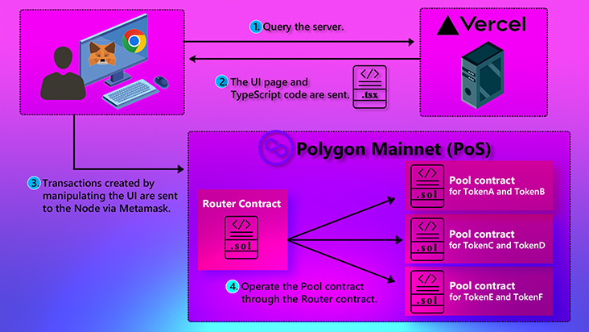

# MooSwap
<p align="center">
  <a href="https://mooswap-finance.vercel.app">
      
  </a>
</p>

Polygon mainnet (PoS) で利用できるAMM型DEXです。Supported tokens are WETH, USDC.e, USDT, WBTC, and DAl.  
WebSite URL [https://mooswap-finance.vercel.app/](https://mooswap-finance.vercel.app/)

## 主な機能
### Swap
<table>
  <tr>
    <td></td>
    <td>WETHを手放してDAIを手に入れたいといったように、トークンを交換したい時に使う機能。しかしこの場合、WETHとDAIのプールが既に存在している必要がある。交換レートは定数積公式により決定される。手数料は0.3%。この手数料が、プールを作ってくれた流動性提供者への報酬になる。</td>
  </tr>
</table>

### Add Liquidity
<table>
  <tr>
    <td></td>
    <td>swapをしたい人のために、2種類のトークンを提供する機能。これによりプールが作られる。もし既にプールが存在すればそのプールに追加される。トークンを提供してくれた流動性提供者には、流動性トークンを発行する。</td>
  </tr>
</table>

### Remove Liquidity
<table>
  <tr>
    <td></td>
    <td>プールに提供していた2種類のトークンを返して欲しい時に使う機能。流動性トークンを渡す事で、提供していたトークンが返ってくる。この時、提供していた量よりも少し増えて戻ってくるので、それが儲けになる。この増えた分は、swapの手数料から来ている。
</td>
  </tr>
</table>

> [!IMPORTANT]
> If this is your first time accessing this site, please connect the Meta Mask manually as you can see. After that, the "Connect Wallet" button will become active.  
> 

## システム構成の概要
### 全体の構成

### コントラクトの構成


## 使用技術
| Category                 | Skills                                                                                                     |
| ------------------------ | ---------------------------------------------------------------------------------------------------------- |
| Languages                | TypeScript (4.9.5)&ensp; /&ensp; SOLIDITY (0.8.17)&ensp; /&ensp; HTML&ensp; /&ensp; CSS&ensp; /&ensp; BASH |
| Frameworks               | NEXT.js (13.2.1)&ensp; /&ensp; Hardhat (2.12.7)&ensp; /&ensp; tailwindcss (3.2.7)                          |
| Libraries                | React (18.2.0)&ensp; /&ensp; ethers.js (5.7.2)&ensp; /&ensp; headless ui (1.7.12)                          |
| Packages                 | nvm (0.39.3)&ensp; /&ensp; npm (8.19.2)&ensp; /&ensp; dotenv (16.0.3)&ensp; /&ensp; Commander.js (10.0.0)&ensp; /&ensp; PostCSS (8.4.21)&ensp; /&ensp; Autoprefixer (10.4.13)&ensp; /&ensp; METAMASK (2.0.0) |
| Testing Frameworks       | MOCHA&ensp; /&ensp; chai                                                                                   |
| Development Environments | Node.js (v18.12.1)&ensp; /&ensp; WSL2&ensp; /&ensp; ubuntu (20.04)                                         |
| Development Tools        | git&ensp; /&ensp; GitHub&ensp; /&ensp; ESLint (8.35.0)                                                     |
| Hosting・Infrastructure  | Vercel&ensp; /&ensp; alchemy  　　　　　　　　　　　　　　　　　　　　　　　　　　　　　　　　　　　　　　　　　　 |
| Design                   | heroicons (2.0.16)                                                                                         |

## Directory structure
### Overall directory structure


### The core directory for the frontend


### The core directory for contracts


## Getting Started
### リポジトリをクローンする前の事前準備(Windowsの場合)
#### wslとUbuntuのインストール(参考 https://learn.microsoft.com/ja-jp/windows/wsl/install)
```bash
wsl --install -d Ubuntu-20.04

# その後ユーザーネームとパスワードを設定
```

#### wslにNode.jsをインストール(参考　https://learn.microsoft.com/ja-jp/windows/dev-environment/javascript/nodejs-on-wsl)
```bash
# curlをインストール(Web上にあるものをダウンロードするために必要なパッケージ)
# この後パスワードを聞かれる場合があるので、上で設定したパスワードを入力
sudo apt-get install curl

# nvmをインストール
curl -o- https://raw.githubusercontent.com/nvm-sh/nvm/v0.39.3/install.sh | bash

# BASHに書き加えた内容を反映させるためPowerShellを一旦閉じて立ち上げ直し、wsl と打ち込み再起動。
# Windowsターミナルを使用しているのであれば wsl の入力は不要。(参考　https://learn.microsoft.com/ja-jp/windows/wsl/setup/environment#set-up-windows-terminal)
#もしくは下記のコマンドを実行。
source ~/.bashrc

# 正常にインストールされているか確認
$ nvm --version
0.39.3

# Nodeをインストール
$ nvm install 18.12.1

# 正常にインストールされているか確認
$ node --version
v18.12.1
$ npm --version
8.19.2
```
#### vscodeがwslにアクセスできるようにするためにVSCodeに以下の拡張機能をインストール  
https://marketplace.visualstudio.com/items?itemName=ms-vscode-remote.vscode-remote-extensionpack  
(参考 https://learn.microsoft.com/ja-jp/windows/wsl/tutorials/wsl-vscode)  
PowerShellまたはWindoowsターミナルのwsl上から`code .` でVSCodeを再起動すると、ターミナルのディレクトリがwslをポイントしてることが確認できる。(VSCodeの左下にWSLのリンクマークが出ているのが確認できる。)

> [!NOTE]
> コントロールパネルの「Windowsの機能の有効化または無効化」で確認できる以下の項目は、今までの手順を踏めば自動で有効になっているはずですが、上手く動作しない場合は確認して手動で有効にして下さい。  
> - Hyper-V  
> - Linux用Windowsサブシステム  
> - 仮想マシンプラットフォーム

### リポジトリをクローンする前の事前準備(Macの場合)
```bash
# nvmをインストール
$ curl -o- https://raw.githubusercontent.com/nvm-sh/nvm/v0.39.3/install.sh | bash

# ターミナルを再起動

# 正常にインストールされているか確認
$ nvm --version
0.39.3

# Nodeをインストール
$ nvm install 18.12.1

# 正常にインストールされているか確認
$ node --version
v18.12.1
$ npm --version
8.19.2
```

#### VSCodeでcodeコマンドのインストール  
`Cmd + Shift + P`でコマンドパレットを開き`Shell command: install'code'command in PATH`　を入力。

### 開発環境セットアップ
```bash
# リポジトリをローカルにクローン
git clone https://github.com/YD-GitGang/UniswapV2-style-DEX---Portfolio---.git

# モジュールのインストールとコントラクトのコンパイル
npm ci && cd hardhat && npm ci && npx hardhat compile && cd ../ 
```
#### Hardhatネットワークを使うためのメタマスクの設定。
ポリゴンのメインネットを使うとお金がかかるので、開発の際はHardhatネットワークを使用。
メタマスクの設定のネットワークに以下の内容ををAdd Networkで追加してください。  
- Network name : Local HardhatNetwork  
- NewRPC URL : http://127.0.0.1:8545  
- Chain ID : 31337  
- Currency symbol : ETH  

hardhatネットワーク用にメタマスクのアカウントを3つほど作成。

> [!IMPORTANT]
> hardhatネットワークを起動していない状態でメタマスクでhardhatネットワークを使おうとすると、メタマスクが固まることがあります。hardhatネットワークを再起動したら、hardhatネットワーク用に使用しているテストアカウントを設定の高度な設定の「アクティビティタブのデータを消去」を実行してアカウントをリセットして下さい。この操作で消える情報というのは、今選択しているネットワークの今選択しているアカウントの情報のみです。

#### 疑似的に本番環境を再現するため事前にコントラクトをデプロイ

```bash
npm run test-node
```
hardhatネットワークを起動して、hardhatネットワークにFactoryコントラクトとRouterコントラクトをデプロイし、4つのトークンをデプロイし、アカウント1とアカウント2にそれぞれ20000ずつ送金し、4つのトークンのいくつかのペアでプールを作成。
FactoryコントラクトとRouterコントラクトと4つのトークンのアドレスはdataフォルダに入力済み。

#### run the development server:

```bash
npm run dev
```

Open [http://localhost:3000](http://localhost:3000) with your browser to see the result.

#### VSCode拡張機能
Solidity (by Juan Blanco)

:+1: ここまでの手順で、Hardhatネットワークを使いローカルで開発できる環境が完成。

## コントラクトを本番環境にdeploy
`.env`ファイルを作成し`PRIVATE_KEY="hoge"`, `SEPOLIA_URL`, `POLYGON_URL` を書いておいて下さい

`scriptsフォルダ`の`deployUniswapStyleDex.ts`を実行してコントラクトをネットワークにデプロイする際は、`hardhat.config.ts`のコメントアウトしてるコード全てを解除して下さい。
フロントエンドをホストするときは再びコメントアウトして下さい。

```bash
$ cd hardhat

$ npx hardhat run --network sepolia scripts/deployUniswapStyleDex.ts

# コンソールに表示されたコントラクトのデータをdataフォルダのcontract.jsonに追加して下さい。

$ npx hardhat compile

$ cd ../

$ npm run build

$ npm run start
```

localhost:3000 でページが表示される

### フロントエンドのコードをVercelにホスト
コントラクトを本番環境にデプロイした際に`hardhat.config.ts`のコメントアウトを解除した箇所を、再びコメントアウトして下さい。コントラクトデプロイ時に使用した`.env`ファイルは`.gitignore`ではじいてリポジトリには無いので、ホスト時に`.env`ファイルが読み取れずエラーになるのを防ぐため。
```bash
# vercelにホスト時に設定するビルドコマンド
$ npm run compile --prefix hardhat && npm run build

# vercelにホスト時に設定するインストールコマンド
$ npm ci && npm ci --prefix hardhat
```
:+1: ここまでの手順で、本番環境にデプロイしたコントラクトに、VercelにホストしたUIからアクセス出来るようになる。

## Test coverage rate

-----------------------------------|----------|----------|----------|----------|----------------|
File                               |  % Stmts | % Branch |  % Funcs |  % Lines |Uncovered Lines |
-----------------------------------|----------|----------|----------|----------|----------------|
 contracts/                        |    94.55 |    68.63 |       84 |    94.84 |                |
  uniswapV2StyleDexERC20.sol       |    83.33 |       50 |    66.67 |    89.47 |    29,33,37,49 |
  uniswapV2StyleDexFactory.sol     |      100 |       50 |      100 |      100 |                |
  uniswapV2StyleDexPool.sol        |      100 |     82.5 |      100 |      100 |                |
  uniswapV2StyleDexRouter.sol      |    94.12 |    64.29 |      100 |     91.3 |    39,40,81,82 |
 contracts/interfaces/             |      100 |      100 |      100 |      100 |                |
  IERC20.sol                       |      100 |      100 |      100 |      100 |                |
 contracts/libraries/              |      100 |    78.57 |      100 |      100 |                |
  Math.sol                         |      100 |    83.33 |      100 |      100 |                |
  uniswapV2StyleDexLibrary.sol     |      100 |       75 |      100 |      100 |                |
 contracts/test/                   |    60.71 |       30 |    56.25 |    68.75 |                |
  MathTest.sol                     |      100 |      100 |      100 |      100 |                |
  TokenTest.sol                    |    60.71 |       30 |    41.67 |    65.91 |... 59,60,61,62 |
  uniswapV2StyleDexLibraryTest.sol |      100 |      100 |      100 |      100 |                |
-----------------------------------|----------|----------|----------|----------|----------------|
All files                          |    88.59 |    63.97 |    75.56 |    89.55 |                |
-----------------------------------|----------|----------|----------|----------|----------------|


## License

This project is unlicensed and all its contents are proprietary and confidential. No part of this project may be copied, modified, or distributed without the explicit permission of the author. Unauthorized use is strictly prohibited.

## Donations

If you would like to support the development of future projects or help pay my next month's rent, you can donate ETH to `0x84fE8C7704a24a0604863718522c8426885105Af`.

> [!WARNING]
> - The swap fee is 0.3% of the deposit.
> - The minimum transaction amount for swap, remove, and add liquidity is set to 0 (a 100% slippage tolerance).
> - The remove amount is not adjustable and will be the full amount.