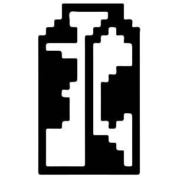

# MooSwap
<p align="center">
  <a href="https://mooswap-finance.vercel.app">
      
  </a>
</p>
Polygon mainnet (PoS) で利用できるAMM型DEXです。Supported tokens are WETH, USDC.e, USDT, WBTC, and DAl.

## 主な機能
### Swap
<div style="display: flex; align-items: center;">
  
  <p>aaaaaaaaaaaaaaaaaaaaaaaaaaaaaaaaaaaaaaaaaaaaaaaaaaaaaaaaaaaaaaaaaaaaaaaaaaaaaaaaaaaaaaaaaaaaaaaaaaaaaaaaaaaaaaaaaaaaaaaaaaaaaaaaaaaaaaaaaaaaaaaaaaaaaaaaaaaaaaa</p>
</div>

### Add Liquidity
<div style="display: flex; align-items: center;">
  
  <p>aaaaaaaaaaaaaaaaaaaaaaaaaaaaaaaaaaaaaaaaaaaaaaaaaaaaaaaaaaaaaaaaaaaaaaaaaaaaaaaaaaaaaaaaaaaaaaaaaaaaaaaaaaaaaaaaaaaaaaaaaaaaaaaaaaaaaaaaaaaaaaaaaaaaaaaaaaaaaaaaaaaaaaaaaaaaaaaaaaaaaaaaaaaaaaaaaaaaaaaaaaaaaaaaaaaaaaaaaaaaaaaaaaaaaaaaaaaaaaaaaaaaaaaaaaaaaaaaaaaaaaaaaaaa</p>
</div>

### Remove Liquidity
<div style="display: flex; align-items: center;">
  
  <p>aaaaaaaaaaaaaaaaaaaaaaaaaaaaaaaaaaaaaaaaaaaaaaaaaaaaaaaaaaaaaaaaaaaaaaaaaaaaaaaaaaaaaaaaaaaaaaaaaaaaaaaaaaaaaaaaaaaaaaaaaaaaaaaaaaaaaaaaaaaaaaaaaaaaaaaaaaaaaaaaaaaaaaaaaaaaaaaaaaaaaaaaaaaaaaaaaaaaaaaaaaaaaaaaaaaaaaaaaaaaaaaaaaaaaaaaaaaaaaaaaaaaaaaaaaaaaaaaaaaaaaaaaaaaaaaaaaaaaaaaaaaaaaaaaaaaaaaaaaaaaaaaaaaaaaaaaaaaaaaaaaaaaaaaaaaa</p>
</div>

> [!IMPORTANT]
> If this is your first time accessing this site, please connect the Meta Mask manually as you can see. After that, the "Connect Wallet" button will become active.  
> 

## システム構成の概要
### 全体の構成

### コントラクトの構成


## 使用技術
| Category                 | Skills                                                                                                     |
| ------------------------ | ---------------------------------------------------------------------------------------------------------- |
| Languages                | TypeScript (4.9.5)&ensp; /&ensp; SOLIDITY (0.8.17)&ensp; /&ensp; HTML&ensp; /&ensp; CSS&ensp; /&ensp; BASH |
| Frameworks               | NEXT.js (13.2.1)&ensp; /&ensp; Hardhat (2.12.7)&ensp; /&ensp; tailwindcss (3.2.7)                          |
| Libraries                | React (18.2.0)&ensp; /&ensp; ethers.js (5.7.2)&ensp; /&ensp; headless ui (1.7.12)                          |
| Packages                 | nvm (0.39.3)&ensp; /&ensp; npm (8.19.2)&ensp; /&ensp; dotenv (16.0.3)&ensp; /&ensp; Commander.js (10.0.0)&ensp; /&ensp; PostCSS (8.4.21)&ensp; /&ensp; Autoprefixer (10.4.13)&ensp; /&ensp; METAMASK (2.0.0) |
| Testing Frameworks       | MOCHA&ensp; /&ensp; chai                                                                                   |
| Development Environments | Node.js (v18.12.1)&ensp; /&ensp; WSL2&ensp; /&ensp; ubuntu (20.04)                                         |
| Development Tools        | git&ensp; /&ensp; GitHub&ensp; /&ensp; ESLint (8.35.0)                                                     |
| Hosting・Infrastructure  | Vercel&ensp; /&ensp; alchemy  　　　　　　　　　　　　　　　　　　　　　　　　　　　　　　　　　　　　　　　　　　 |
| Design                   | heroicons (2.0.16)                                                                                         |

### VSCode拡張機能  
Solidity (by Juan Blanco)

## Getting Started

```bash
git clone https://github.com/YD-GitGang/UniswapV2-style-DEX---Portfolio---.git
```

```bash
npm ci && cd hardhat && npm ci && npx hardhat compile && cd ../ 
```

```bash
npm run test-node 
```

First, run the development server:

```bash
npm run dev
```

Open [http://localhost:3000](http://localhost:3000) with your browser to see the result.

## License

This project is unlicensed and all its contents are proprietary and confidential. No part of this project may be copied, modified, or distributed without the explicit permission of the author. Unauthorized use is strictly prohibited.

## Donations

If you would like to support the development of future projects or help pay my next month's rent, you can donate ETH to `0x84fE8C7704a24a0604863718522c8426885105Af`.

> [!WARNING]
> - The swap fee is 0.3% of the deposit.
> - The minimum transaction amount for swap, remove, and add liquidity is set to 0 (a 100% slippage tolerance).
> - The remove amount is not adjustable and will be the full amount.